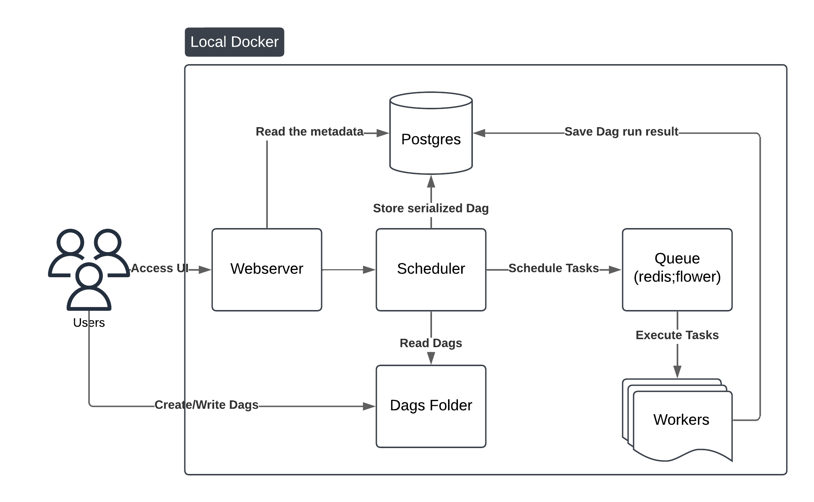

# Airflow

## O que é

Este projeto utiliza o Apache Airflow para orquestração de workflows. Ele inclui a configuração de um ambiente Airflow com PostgreSQL e Redis, além de um DAG de exemplo chamado `smooth`.

## Estrutura do Projeto

```sh
├── assets/
│ └── local-airflow-diagram.png
├── aws-proposal/
│ └── airflow-aws.png
│ └── README.md
├── dags/
│ └── smooth.py
├── logs/
│ └── .gitkeep
├── plugins/
│ └── .gitkeep
└── requirements/
│  └── run.txt
├── .gitignore
├── compose.yaml
├── LICENSE
├── PROBLEMS.md
├── README.md
```

## Configuração do Ambiente

O projeto utiliza Docker Compose para configurar os serviços necessários. O arquivo [compose.yaml](compose.yaml) define os seguintes serviços:

[](assets/local-airflow-diagram.png)

- **PostgreSQL**: Banco de dados para os metadados do Airflow.
- **Redis**: Broker para o Celery Executor.
- **Airflow Webserver**: Interface web do Airflow.
- **Airflow Scheduler**: Responsável por agendar as tarefas e realizar a validação/serialização das Dags.
- **Airflow Worker**: Executa as tarefas agendadas.
- **Flower**: Interface web para monitoramento do Celery.

## Requisitos

- Git
- Python 3.8+
- Docker
- Docker Compose

## Instalação

1. Clone o repositório:

    ```sh
    git clone https://github.com/mat-machado/dre-3-test
    cd dre-3-test
    ```

2. Crie e ative um ambiente virtual:

    ```sh
    python -m venv .venv
    source .venv/bin/activate
    ```

3. Instale as dependências:

    ```sh
    pip install -r requirements/run.txt
    ```

4. Inicie os serviços:

    ```sh
    sudo chown -R 5000:5000 ./logs
    docker compose up -d
    ```

## DAG de Exemplo

O projeto inclui um DAG de exemplo chamado `smooth`, definido no arquivo [dags/smooth.py](dags/smooth.py). Este DAG utiliza o operador `SmoothOperator` para executar uma tarefa chamada `youtube_video`.

## Problemas Conhecidos e Soluções

Veja o arquivo [PROBLEMS.md](PROBLEMS.md) para uma lista de problemas conhecidos e suas soluções.

## Proposta de arquitetura Cloud na AWS

Uma proposta para subir na nuvem AWS foi criada e descrita no documento [README.md](aws-proposal/README.md)

## Licença

Este projeto está licenciado sob a Licença Apache 2.0. Veja o arquivo [LICENSE](LICENSE) para mais detalhes.
