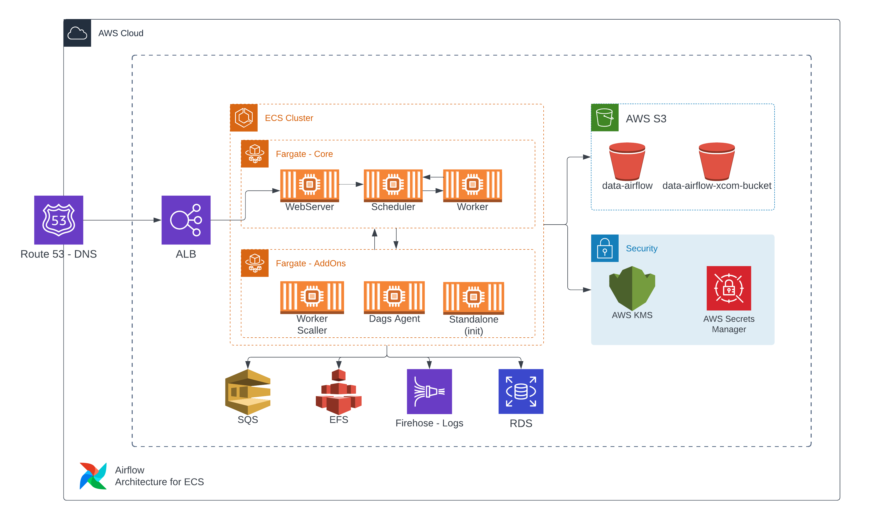

# Proposta do Airflow na AWS

Uma documentação para explicar o conteudo da imagem de arquitetura proposta do Airflow na AWS.

## Componentes

### Route 53

- Será responsável pelo serviço de DNS para o usuário acessar a UI, bem como para entre os componentes internamente.
  - Ex.: airflow.example.com; airflow-db.example.com

### Application Load Balancer (ALB)

- Será responsável por realizar o balanceamento de carga vindo do DNS para a UI do Airflow (Webserver).

### WebServer

- Serviço responsável por fornecer uma interface gráfica ao usuário. Coletando os metadados do RDS Postgres para exibir ao usuário, contendo o histórico, logs, etc...
- Ele poderá ser sob-demanda, por horário, ou por requisição recebida.
  - Ex.: Executando das 08:00-22:00 ou quando receber uma requisição do ALB e o mesmo retornar um 502/504, então irá subir uma nova task.
- O serviço está em um ALB devido a possíbilidade de executar 1 ou mais instancias ao mesmo tempo, devido a carga necessária.

### Scheduler

- Principal serviço da aplicação Airflow, é responsável por diversos processos, mas entre eles dois principais:
  1. Fazer a serialização/validação da Dag.
      - O serviço do Scheduler vai até a pasta Dags e lê todos os arquivos e faz uma validação do código, apontando erros caso existam.
  2. Agendador das Tarefas/Dags.
      - O Scheduler como seu próprio nome diz, é o responsável por agendar e disparar as tasks ao executor das tarefas em sí.
- Devido a criticidade do serviço e recursos que pode vir a utilizar (dependendo da quantidade de tasks, agendamentos), é um ótimo candidato a escalonamento, do qual estará sempre rodando com no mínimo 2 tasks para garantir a disponibilidade, e terá um escalonamento ativado ao depender do uso de CPU.

### Simple Queue Service (SQS)

- Serviço de mensageria gerenciado pela AWS. Entrará em nossa estrutura substituindo o Redis padrão, pois assim temos um serviço estável e que não se faz necessário uma futura manutenção.
Ele recebe o agendamento do Scheduler, para ser consumido pelo Worker.
- OBS: se faz necessário um pequeno script para realizar essa adaptação ao Airflow.

### Worker

- É o responsável por executar os Scripts contidos dentro de Dags. Seu processo fica avaliando a fila do SQS, encontrando uma mensagem, é iniciado o processamento.
- Após a execução, de sucesso ou não, salva o metadado no RDS Postgres, para ser analisado pelo usuário posteriormente e ter a informação de histórico.
- Como é o serviço responsável pela execução, possui muita carga, então é altamente escalavel, o qual é feito pelo serviço Worker Scaller.

### Worker Scaller

- Serviço desenvolvido a parte para controlar o escalonamento do Worker. Ficará lendo as métricas do Airflow via CLI para identificar e calcular a quantidade de tasks necessárias de Workers a partir da quantidade de tarefas a serem executadas.

### Kinesis Firehose

- Serviço gerenciado pela AWS, que recebe informações em streaming e exporta para um conector, bem como pode fazer um pré-processamento da informação antes de salvar.
- Será utilizado nessa estrutura para receber todos os logs de todos os serviços, e salvar em um Bucket S3, para ter o log salvo independente das Tasks no ECS.
- Todo log é criptografado por uma chave KMS, onde apenas roles internas do Airflow ou adminstradores podem descriptografar.

### Dags Agent

- Serviço criado a parte, para fazer o sincronismo entre as Dags armazenadas no S3 e no EFS, para serem consumidas pelo Scheduler.
- É apenas um agendador com um comando de `aws s3 sync`, onde o agente possui uma conexão com o EFS que será consumido pelo Scheduler.

### Elastic File System (EFS)

- Serviço gerenciado pela AWS, de armazenamento compartilhado. Será utilizado na estrutura para armazenar as Dags e serem consumidar por N Schedulers, assim é possível manter o escalonamento sem precisar se preocupar em manter o mesmo dados em todas as tasks ECS.

### Relational Database Service (RDS)

- Serviço de banco de dados relacional gerenciado pela AWS. Será utilizando um banco de dados PostgreSQL para salvar os metadados de execução gerados pelos Workers e consumidos pelo Webserver, para possuir todo o histórico de execução de cada Dag/Task.

### Simple Storage Service (S3)

- O S3 terá dois principais papéis nessa arquitetura:

  1. Armazenamento das Dags geradas pelos desenvolvedores:
      - Após criar a Dag, será feito um sincronismo da mesma para um Bucket no S3, onde posteriormente será consumida pelo Dags Agent e por fim salva no EFS para uso no Scheduler.
  2. Armazenamento dos XCOMs do Airflow:
      - Para garantir segurança e resiliência das conexões utilizadas pelo Airflow durante a execução de tarefas, configurações internas, etc... Será utilizado um Bucket do S3 como um banco de key:value, tanto para o uso do Airflow em si, quanto para salvar os dados solicitados pelas Dags durante a sua execução.
      Ex.: Uma Dag solicita um paramento na Parameter Store, esse valor será salvo como XCOM para uso e não será mais necessário consulta no SSM.

- É necessário um script a parte para realizar a criptografia e descriptografia dos dados nesse Bucket.
- É utilizado uma chave KMS para criptografar estes dados, e apenas a role de execução do Airflow possui acesso para realizar a descriptografia.

### Standalone Service

- Serviço criado a parte que será executado apenas na primeira execução do Airflow, ou após um Upgrade de versão.
- É responsável por configurações internas da aplicação, como criação de arquivos, migration de banco etc...

### AWS Secrets Manager

- Será utilizado o Secrets Manager para armazenar as senhas de acesso a banco de dados dos metadados do Airflow. Bem como algum outro segredo interno da aplicação.

## Decisões técnicas

### Uso de ECS e Fargate

O uso de ECS e Fargate pode ser um pouco não intuitivo para uma aplicação assim, porém pensando que o Airflow em si não deveria ter grandes processamentos e ser apenas um orquestrador, o uso de serviços Serveless é uma decisão de facil manutenção aqui.

Em um ambiente onde teremos em média 1 Webserver, 2 Schedulers, 2 Workers, Worker Scaller e Dag Agent rodando, estamos falando de poucos recursos para cada Task ECS, apenas o Scheduler requer um uso mais intenso, e o Worker fica escalando de acordo com a necessidade, o Fargate fará um trabalho excelente com um custo aceitavel.

Porém se formos pensar em um ambiente com centenas ou até milhares de Dags em execução, podemos trocar o uso de Fargate para o tradicional em EC2, do qual teremos um scaling tanto horizontal quanto vertical, tendo a possibilidade de subir dezenas de tasks em uma mesma instancia EC2.

### Uso de serviços gerenciaveis

O uso de serviços gerenciados pela AWS, onde precisamos dar pouca ou nenhuma manutenção, é essencial nessa estrutura, pois conseguimos ter um ambiente super estavel, escalavel e onde apenas precisamos precisamos nos preocupar apenas com a atualização da aplicação em si.

É claro que em um possível TShoot o processo pode ficar mais complexo, devido a quantidade de camadas que conversam entre si, porém ja podemos descartar erros de versão ou erros humanos nessas ferramentas.

### MWAA x Airflow in house

A AWS possui o Managed Workflows for Apache Airflow, que é o Airflow gerenciado. Porém não terá um controle tão grande e ficará preso em algumas configurações e poucas customizações, bem como dependendo do ambiente, pode ter dificuldades com o escalonamento interno, onde não possui controle.
